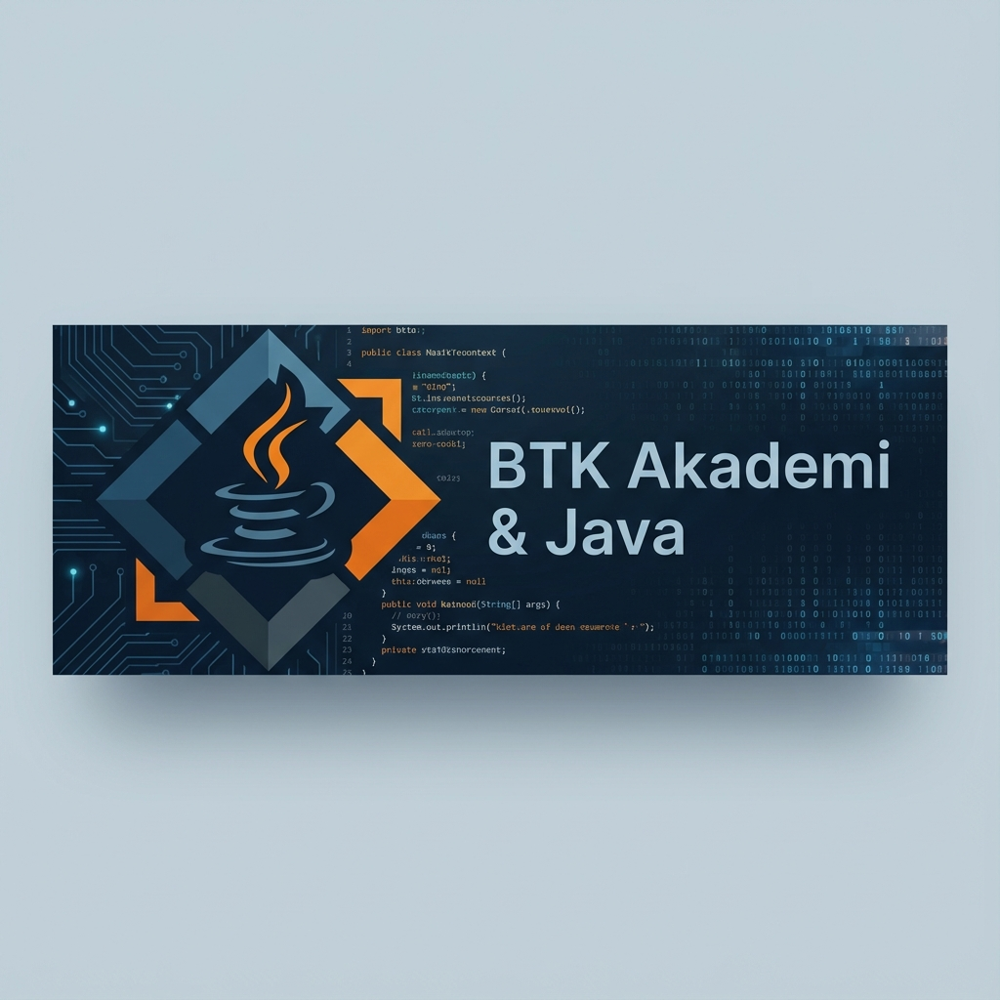

# BTK Akademi Java Course Projects ☕



[](https://www.java.com/)
[](https://www.btkakademi.gov.tr/)
[](LICENSE)
[]()

## 📚 About The Project

This repository contains the source code and projects developed during the **BTK Academy Java Course**. It serves as a comprehensive resource for learning Java programming, ranging from basic syntax to advanced concepts like Object-Oriented Programming (OOP) and Data Structures.

Whether you are a beginner starting your coding journey or looking to refresh your Java skills, this repository provides structured examples and practical implementations.

## 📂 Project Structure

The repository is organized into various directories, each focusing on a specific topic or concept:

| Category | Directory | Description |
|----------|-----------|-------------|
| **Basics** | `variables`, `datatypes`, `conditionals` | Introduction to variables, data types, and control flow. |
| **Logic** | `loopDemo`, `switchDemo`, `arraysDemo` | Implementation of loops, switch cases, and arrays. |
| **OOP** | `classes`, `inheritance`, `polymorphismDemo` | Core Object-Oriented Programming concepts. |
| **Advanced OOP** | `abstractClasses`, `interfaces`, `generics` | Abstract classes, interfaces, and generic programming. |
| **Data Structures** | `arrayListDemo`, `hashMapDemo` | Working with collections like ArrayLists and HashMaps. |
| **File I/O** | `workingWithFiles`, `readingFileDemo` | Reading from and writing to files. |
| **Error Handling** | `exceptionHandling`, `throwDemo` | Managing exceptions and creating robust code. |
| **Database** | `jdbcIntro`, `repositoryDemo` | Introduction to JDBC and database interactions. |

*(Note: This is a highlighted list. Explore the repository for more topics!)*

## 🚀 Getting Started

To run these projects on your local machine, follow these steps:

### Prerequisites

*   **Java Development Kit (JDK)**: Ensure you have JDK 8 or higher installed.
*   **IDE**: Intelli J IDEA, Eclipse, or VS Code is recommended.

### Installation

1.  **Clone the repository**:
    ```bash
    git clone https://github.com/bahattinyunuscetin/btk-java-course-projects.git
    ```
2.  **Open in IDE**:
    Open the cloned folder in your preferred Java IDE.
3.  **Run**:
    Navigate to `src/Main.java` (or the specific main file of a module) and run the application.

## 🛠️ Technologies Used

*   **Java**: The primary programming language.
*   **JDBC**: For database connectivity.
*   **Object-Oriented Design**: Principles used throughout the projects.

## 🤝 Contributing

Contributions are welcome! If you have suggestions or improvements, please fork the repository and submit a pull request.

1.  Fork the Project
2.  Create your Feature Branch (`git checkout -b feature/AmazingFeature`)
3.  Commit your Changes (`git commit -m 'Add some AmazingFeature'`)
4.  Push to the Branch (`git push origin feature/AmazingFeature`)
5.  Open a Pull Request

## 📜 License

Distributed under the MIT License. See `LICENSE` for more information.

## 🔗 Connect

**Bahattin Yunus Çetin**

[](https://www.linkedin.com/in/bahattinyunuscetin)
[](https://github.com/bahattinyunuscetin)

---
*Happy Coding!* 🚀
